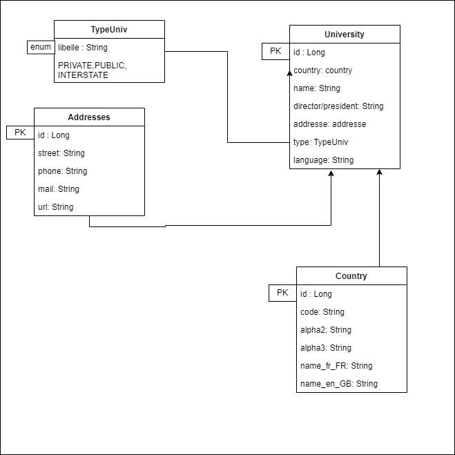
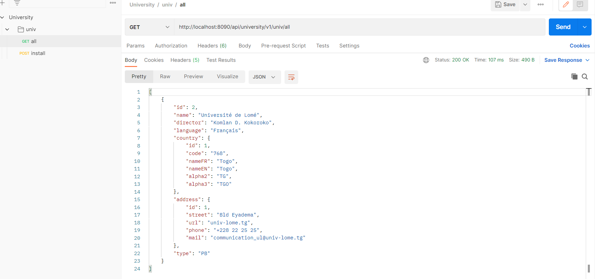

# 30DaysOfLearningChallenge_GDSC
30DaysOfLearningChallenge_GDSC is a challenge to learn some stack
Principaly here, i wrote Togo universities name, foundation date, director and other </b>
attributes of an univerty : Togo Universities API </b>
Feel free to update DB adding university of your country setting up the country code ; star the project too
## Day1
><i>en_US :</i>
First day, looking for the recommended framework to develop APIs with Java. I started working on java and I find that java can do great things, I understand why big companies use it.
><i>fr_FR :</i>
Premier jour, chercher le framework recommandé pour développer des API avec Java. J'ai commencé des travaux sur java et je trouve que java peut faire de grandes choses, je comprends pourquoi les grosses boîtes l'utilisent.
## Day2
><i>en_US :</i>
Learned what is Spring Boot
## Day3
><i>en_US :</i>
Learned JPA, Hibernate, Lombok and API REST
## Day4
><i>en_US :</i>
1. Build an api that retrieves information about universities in my country (project can be improved to retrieve more information and in other countries too)
2. Designing the model class for the API

## Day5
><i>en_US :</i>
First Run Done

## Day6
><i>en_US :</i>
Project Created (maven Pom + dependencies)
    Application Properties updated

## Day7 to Day20
><i>en_US :</i>
Coding and Learning (API Rest : Best Pratices [Microsoft Learn API courses] )
